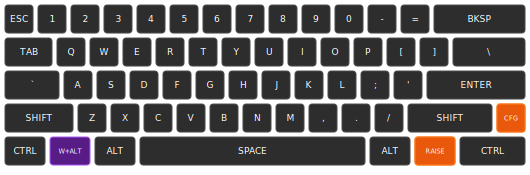
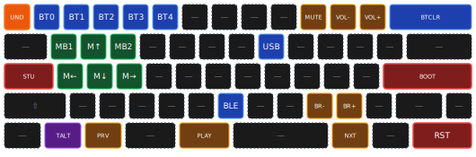
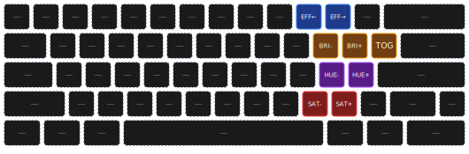

# Cyber60 Keyboard Keybinding Schema

Comprehensive documentation for the Cyber60 Rev D keyboard 5-layer system with visual SVG diagrams matching the actual keyboard aesthetic.

## Overview

The Cyber60 features a sophisticated 5-layer keymap with custom behaviors, layer-tap functionality, and comprehensive system controls.

## Layer System Architecture

The keyboard has 5 distinct layers:

1. **Layer 0 (DEFAULT)**: Base QWERTY layout
2. **Layer 1 (ALTERNATIVE)**: QWERTY with Win+Alt combo key
3. **Layer 2 (RAISE)**: Function keys, navigation, media, mouse buttons
4. **Layer 3 (CONFIGURATION)**: Bluetooth, mouse movement, media controls, system functions
5. **Layer 4 (UNDERGLOW)**: RGB lighting controls

### Layer Access Methods

| Layer | Access Method | Key Location | Behavior |
|-------|---------------|--------------|----------|
| DEFAULT | Base layer | - | Always active unless another toggled on |
| ALTERNATIVE | Toggle | CFG → TALT (Win position) | Toggle on/off from CONFIGURATION layer |
| RAISE | Momentary | Right side between ALT and CTRL | Hold to activate, release to return |
| CONFIGURATION | Layer-tap | Far right of Row 4 (CFG) | Tap or hold to activate |
| UNDERGLOW | Momentary | CFG → UND (ESC position) | Hold from CONFIGURATION layer |

## Layer Layouts

### Layer 0: DEFAULT - Base QWERTY

**Layout Features:**
- Standard QWERTY typing layout
- **GRAVE** key (backtick `) on Row 3 left side
- **Long spacebar** spanning 4 key positions
- **Duplicate LSHFT** on Row 4 positions 1 and 2
- **NO right Windows key** - bottom row: CTRL, WIN, ALT, SPACE, ALT, RAISE, CTRL
- Two layer access keys highlighted in orange: **CFG** (K_CMENU) and **RAISE**

**Special Keys:**
- **CFG** (orange, far right Row 4): Layer-tap to CONFIGURATION layer
- **RAISE** (orange, Row 5): Momentary access to RAISE layer
- **Encoder**: Twist for volume, click for play/pause

---

### Layer 1: ALTERNATIVE - Win+Alt Combo Mode

**Differences from DEFAULT:**
- **WIN key** (purple) outputs **Right GUI + Right Alt** combo (RG(RIGHT_ALT))
- Useful for specific keyboard shortcuts requiring Win+Alt combination
- All other keys identical to DEFAULT layer

**Activation:**
- Toggle on/off from CONFIGURATION layer (CFG → TALT at Win position)
- Once activated, stays active until toggled off
- Returns to this layer instead of DEFAULT when releasing other momentary layers

---

### Layer 2: RAISE - Function & Navigation

**Key Groups:**
- **Function Keys** (blue): F1-F12 on number row
- **Navigation** (green): CAPS, arrows (ASD), HOME/END (QE), PG↑/PG↓ (left of ;  and /)
- **Media** (yellow): DEL, INS, PSCRN
- **Mouse** (pink): MB4 (second Shift), MB5 (X key)
- **Transparent** (gray dashed): All other keys pass through to base layer

**Access:** Hold RAISE key (Row 5, right side between ALT and CTRL)

**Key Positions:**
- Row 1: —, F1-F12, DEL, DEL
- Row 2: —, HOME, ↑, END, —×4, INS, —, PSCRN, —×2
- Row 3: CAPS, ←, ↓, →, —×6, PG↑, —×2
- Row 4: —, MB4, —, MB5, —×6, PG↓, —×2
- Row 5: All transparent

---

### Layer 3: CONFIGURATION - System & Bluetooth

**Key Groups:**
- **Bluetooth** (blue): BT0-BT4 profiles, USB/BLE selection, BTCLR
- **Mouse Movement** (green): MB1/MB2, directional movement (WASD pattern on Row 2-3)
- **Media Controls** (yellow): Mute, Volume, Next/Prev, Brightness
- **System Functions** (red): Studio unlock, Bootloader, Reset
- **Layer Controls** (orange/purple): UNDERGLOW access, ALTERNATIVE toggle

**Access:** Tap or hold CFG key (far right of Row 4)

**Key Positions:**
- Row 1: **UND**, BT0-BT4, —×4, MUTE, VOL-, VOL+, BTCLR×2
- Row 2: —, MB1, M↑, MB2, —×4, USB, —×5
- Row 3: **STU**, M←, M↓, M→, —×6, NEXT, PREV, —×3, **BOOT**
- Row 4: —×6, BLE, —×2, BR-, BR+, —×3
- Row 5: —, **TALT**, —×7, **RST**

**Special Functions:**
- **UND** (ESC position): Hold to access UNDERGLOW layer
- **STU** (GRAVE position): Unlock ZMK Studio
- **BOOT** (far right Row 3): Enter bootloader/DFU mode
- **RST** (far right Row 5): System reset
- **TALT** (WIN position): Toggle ALTERNATIVE layer on/off
- **USB/BLE**: Force output connection type

---

### Layer 4: UNDERGLOW - RGB Lighting

**Key Groups:**
- **Effects** (blue): EFF← / EFF→ (-, =)
- **Brightness** (yellow): BRI- / BRI+ / TOG ([, ], \)
- **Hue** (purple): HUE- / HUE+ (', NUHS)
- **Saturation** (red): SAT- / SAT+ (., /)

**Access:** From CONFIGURATION layer, hold UND key (ESC position)

**RGB Controls:**
- Row 1: —×10, **EFF←**, **EFF→**, —×3
- Row 2: —×10, **BRI-**, **BRI+**, **TOG**
- Row 3: —×10, **HUE-**, **HUE+**, —×2
- Row 4: —×10, **SAT-**, **SAT+**, —×2
- Row 5: All empty (—)

**Functions:**
- **EFF←/EFF→**: Cycle through RGB effect patterns
- **BRI-/BRI+**: Adjust LED brightness
- **TOG**: Toggle RGB underglow on/off
- **HUE-/HUE+**: Shift color hue
- **SAT-/SAT+**: Adjust color saturation

---

## Custom Behaviors

### Tap Dance (td0) - NOT CURRENTLY USED
Defined but not assigned in current keymap. Would provide:
- Single tap: Left GUI
- Double tap: Right GUI + Right Alt combo

### Layer-Tap (lt)
- **CFG Key**: Tap for context menu, hold for CONFIGURATION layer
- Provides dual functionality for single key

### Momentary Layer (mo)
- **RAISE**: Hold to activate, release to return to base
- **UNDERGLOW**: Hold from CONFIGURATION to access RGB controls

### Toggle Layer (tog)
- **ALTERNATIVE**: Stays active until toggled off
- Accessed via TALT key in CONFIGURATION layer

---

## Hardware Specifications

- **MCU**: nRF52840 (ARM Cortex-M4, BLE 5.0, USB 2.0)
- **RGB**: 16 WS2812 LEDs via SPI3
- **Encoder**: Rotary with push button (volume/play-pause)
- **Pointing**: Mouse movement support (speed: 1500)
- **Layout**: Custom 60% with long spacebar
- **Connectivity**: Bluetooth LE (4 profiles) + USB
- **Studio**: ZMK Studio compatible via CDC ACM UART

## Usage Guide

### Quick Access Shortcuts

**Function Keys:** Hold RAISE + 1-9, 0, -, = for F1-F12
**Navigation:** Hold RAISE + Q/W/E for HOME/UP/END, A/S/D for arrows
**Bluetooth Profiles:** CFG → 1/2/3/4/5 for BT0-BT4
**Clear BT:** CFG → BTCLR (backspace)
**RGB Toggle:** CFG → UND (hold) → TOG
**Bootloader:** CFG → BOOT (far right Row 3)
**System Reset:** CFG → RST (far right Row 5)
**Alternative Mode:** CFG → TALT (Win position) to toggle Win+Alt combo

### Firmware Updates

1. Enter bootloader: CFG → BOOT
2. Or hold ESC while plugging in USB
3. Flash new firmware via UF2 file

### ZMK Studio Access

1. CFG → STU (GRAVE position) to unlock
2. Connect via USB
3. Use ZMK Studio for runtime configuration

## Visual Design

All SVG diagrams use consistent dark theme styling:
- **Size**: 530×175px (compact 60% keyboard representation)
- **Style**: Dark keys (#2d2d2d) on transparent background
- **Color coding**: Functional groups for easy identification
- **No encoder graphics**: Pure keyboard layout focus
- **Highlighting**: Orange for layer access keys

---

*Documentation generated from `/home/kahan/sources/zmk-config/config/cyber60_rev_d.keymap`*
