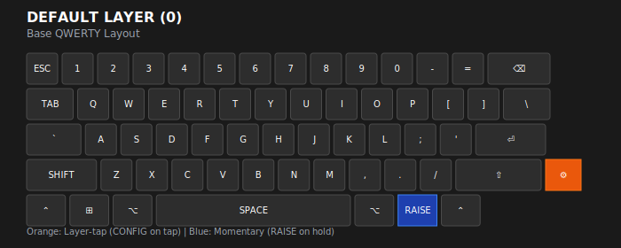
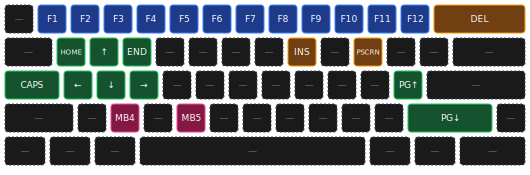
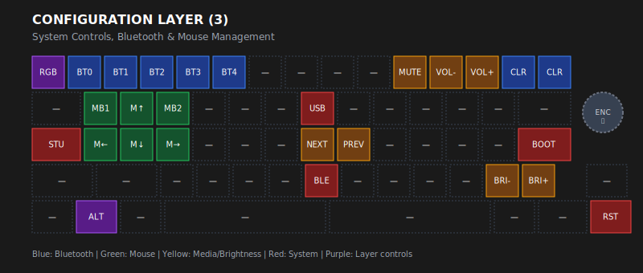
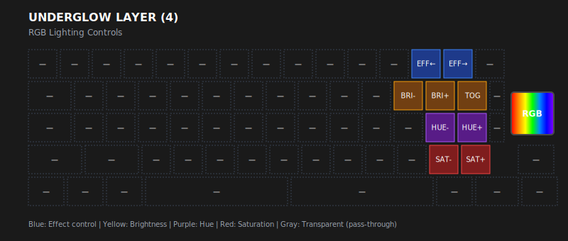

# Cyber60 Keyboard Keybinding Schema

This document provides a comprehensive analysis of the Cyber60 Rev D keyboard keybinding structure with dark theme SVG diagrams matching the actual keyboard aesthetic.

## Overview

The Cyber60 keyboard features a sophisticated 5-layer system with custom behaviors, momentary layers, and special functions. This documentation visualizes the keybinding architecture with a dark theme that matches the actual keyboard's appearance.

## Layer System Architecture

The keyboard features 5 distinct layers with a dark theme design:

### Layer Navigation Flow

**Primary Access Methods:**
- **DEFAULT** → **RAISE**: Hold Right Alt (momentary)
- **DEFAULT** → **CONFIGURATION**: Tap Context Menu (layer-tap)
- **CONFIGURATION** → **ALTERNATIVE**: Toggle Alternative layer
- **CONFIGURATION** → **UNDERGLOW**: Hold RGB key (momentary)

**Layer Return:**
- Release momentary keys to return to previous layer
- Toggle layers stay active until toggled again

## Layer Layouts

### DEFAULT Layer (0) - Base QWERTY

**Features:**
- Standard QWERTY typing layout with dark theme keys
- Tap dance Win key (single tap = Left GUI, double tap = Right GUI + Right Alt)
- Rotary encoder: Volume up/down, Play/Pause click
- Access to other layers via special keys

**Key Highlights:**
- **Context Menu** (orange): Layer-tap to CONFIGURATION layer
- **Right Alt** (blue): Momentary RAISE layer
- **Encoder**: Volume control and media playback

### ALTERNATIVE Layer (1) - Win+Alt Mode

Same layout as DEFAULT layer but with modified Win key behavior:
- Win key activates Right GUI + Right Alt combination
- Useful for specific keyboard shortcuts
- Accessed via toggle from CONFIGURATION layer

### RAISE Layer (2) - Function & Media Controls

**Key Groups:**
- **Function Keys** (blue): F1-F12, Delete
- **Navigation** (green): Arrow keys, Home, End, Page Up/Down
- **Media** (yellow): Insert, Print Screen
- **Mouse** (pink): Mouse buttons 4-5
- **Transparent**: Pass-through to DEFAULT layer

**Common Uses:**
- Function key access (F1-F12)
- Navigation and media control
- Additional mouse buttons

### CONFIGURATION Layer (3) - System Controls

**Key Groups:**
- **Bluetooth** (blue): BT0-4 selection, Clear, Underglow access
- **Mouse** (green): MB1, mouse movement controls, MB2
- **Media** (yellow): Mute, Volume, Next/Previous, Brightness
- **System** (red): USB/BLE output, Studio unlock, Bootloader, Reset
- **Layer** (purple): Alternative layer toggle

**Key Functions:**
- **BT0-BT4**: Select Bluetooth profile
- **CLR**: Clear current Bluetooth profile
- **USB/BLE**: Force output connection type
- **STU**: Unlock ZMK Studio
- **BOOT**: Enter bootloader mode
- **RST**: System reset
- **ALT**: Toggle Alternative layer

### UNDERGLOW Layer (4) - RGB Controls

**Key Groups:**
- **Effect Control** (blue): Effect forward/reverse
- **Brightness** (yellow): Brightness down/up, toggle on/off
- **Hue Control** (purple): Hue down/up adjustment
- **Saturation Control** (red): Saturation down/up adjustment
- **Transparent**: Pass-through to CONFIGURATION layer

**RGB Functions:**
- **EFF←/EFF→**: Cycle through RGB effects
- **BRI-/BRI+**: Decrease/increase brightness
- **TOG**: Toggle RGB on/off
- **HUE-/HUE+**: Adjust color hue
- **SAT-/SAT+**: Adjust color saturation

## Custom Behaviors

### Tap Dance (td0)
- **Single tap**: Left GUI (Windows key)
- **Double tap**: Right GUI + Right Alt combination
- Useful for both standard Win key functionality and specific shortcuts

### Key Toggle (kt_on)
- Toggle-on-only behavior
- Stays active once enabled

### Sensor Bindings
- **Rotary Encoder**: Volume up/down by default, Play/Pause on click
- **Pointing Device**: Enhanced mouse movement (speed: 1500 vs default 600)

## Key Features Summary

### Hardware Specifications
- **MCU**: nRF52840 (ARM Cortex-M4)
- **RGB**: 16 WS2812 LEDs with SPI3 control
- **Encoder**: Rotary encoder with push button
- **Pointing**: Mouse movement and button support
- **Connectivity**: Bluetooth LE + USB with ZMK Studio

### Dark Theme Design
- **Background**: Dark (#1a1a1a) matching real keyboard
- **Keys**: Dark gray with subtle borders
- **Text**: White/light for high contrast
- **Color coding**: Functional groups with distinct colors
- **Encoder**: Positioned on right side as in actual layout

### Layer Access Summary
| Layer | Access Method | Key | Behavior |
|-------|----------------|-----|----------|
| DEFAULT | Base layer | - | Always active |
| RAISE | Momentary | Right Alt | Hold to activate |
| CONFIGURATION | Layer-tap | Context Menu | Tap to activate |
| ALTERNATIVE | Toggle | CONFIG → ALT | Toggle on/off |
| UNDERGLOW | Momentary | CONFIG → RGB | Hold to activate |

### Special Functions
- **studio_unlock**: Enable ZMK Studio runtime configuration
- **bootloader**: Enter DFU mode for firmware updates
- **sys_reset**: Perform system reset
- **RGB underglow**: 16 LED strip with SPI control
- **Pointing device**: Enhanced mouse control

## File Reference

- **Configuration**: `config/cyber60_rev_d.keymap`
- **Hardware Definition**: `config/boards/arm/cyber60_rev_d/cyber60_rev_d.dts`
- **Build Configuration**: `build.yaml`

## Usage Tips

1. **Layer Navigation**: Use Right Alt for quick access to function keys, Context Menu for system controls
2. **Bluetooth Management**: Access via CONFIGURATION layer (Context Menu → BT keys)
3. **RGB Control**: Access via CONFIGURATION layer (Context Menu → RGB key → UNDERGLOW layer)
4. **Mouse Control**: Use CONFIGURATION layer for mouse movement and RAISE layer for mouse buttons 4-5
5. **Firmware Updates**: Use BOOT key in CONFIGURATION layer to enter bootloader mode

## Visual Design

All SVG diagrams follow a consistent dark theme that matches the actual keyboard:
- **Dark background** with high contrast text
- **Accurate 60% keyboard layout** with proper key positioning
- **Realistic key styling** with subtle borders and rounded corners
- **Color-coded functional groups** for easy identification
- **Encoder position** matching the actual hardware layout

This documentation provides a comprehensive overview of the Cyber60 keyboard's keybinding structure, showing how the layers interact and the special behaviors configured in the ZMK firmware, with visual representations that accurately match the real keyboard's appearance.

Generated from ZMK configuration analysis.