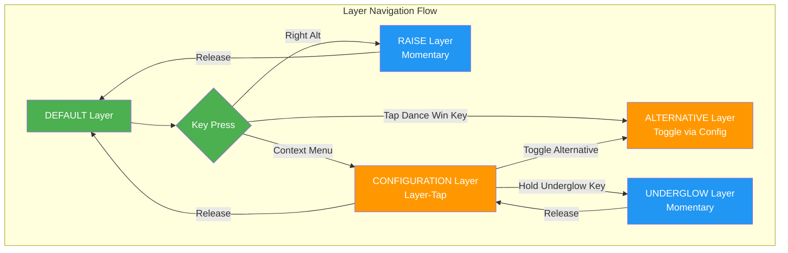
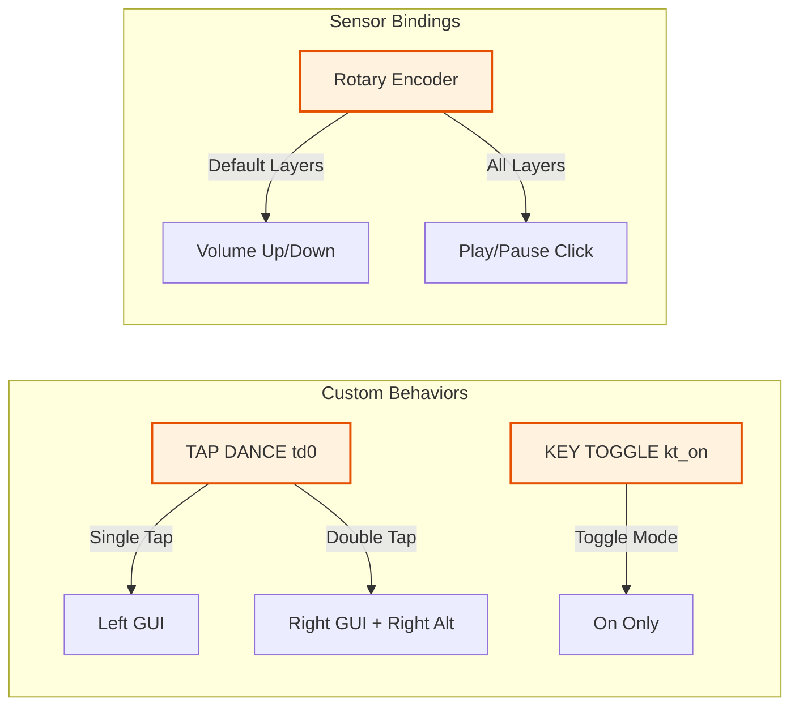

# Cyber60 Keyboard Keybinding Schema

This document provides a comprehensive analysis of the Cyber60 Rev D keyboard keybinding structure using Mermaid diagrams.

## Overview

The Cyber60 keyboard features a sophisticated 5-layer system with custom behaviors, momentary layers, and special functions. This documentation visualizes the keybinding architecture for easier understanding and reference.

## Layer System Architecture

```mermaid
graph TB
    %% Layer System Overview
    subgraph "Layer Hierarchy"
        DEFAULT[DEFAULT Layer 0<br/>Base QWERTY]
        ALTERNATIVE[ALTERNATIVE Layer 1<br/>Win+Alt Mode]
        RAISE[RAISE Layer 2<br/>Function/Media]
        CONFIGURATION[CONFIGURATION Layer 3<br/>System/Bluetooth]
        UNDERGLOW[UNDERGLOW Layer 4<br/>RGB Controls]
    end

    %% Layer Navigation
    DEFAULT -->|mo RAISE (RAlt)| RAISE
    DEFAULT -->|lt CONFIGURATION (Context Menu)| CONFIGURATION
    CONFIGURATION -->|tog ALTERNATIVE| ALTERNATIVE
    CONFIGURATION -->|mo UNDERGLOW| UNDERGLOW

    %% Special Behaviors
    subgraph "Special Behaviors"
        TAPDANCE[td0: Tap Dance<br/>Single: LGUI<br/>Double: RG(RIGHT_ALT)]
        KEYTOGGLE[kt_on: Key Toggle On Only]
    end

    %% Hardware Features
    subgraph "Hardware Integration"
        ENCODER[Rotary Encoder<br/>Default: Volume Up/Down<br/>Click: Play/Pause]
        POINTING[Pointing Device<br/>Move Value: 1500]
        RGB[RGB Underglow<br/>16 LEDs WS2812]
    end

    %% Connection to layers
    DEFAULT -.-> TAPDANCE
    ALTERNATIVE -.-> TAPDANCE
    RAISE -.-> POINTING
    CONFIGURATION -.-> ENCODER
    UNDERGLOW -.-> RGB

    %% Styling
    classDef layer fill:#e1f5fe,stroke:#01579b,stroke-width:2px
    classDef behavior fill:#f3e5f5,stroke:#4a148c,stroke-width:2px
    classDef hardware fill:#e8f5e8,stroke:#1b5e20,stroke-width:2px

    class DEFAULT,ALTERNATIVE,RAISE,CONFIGURATION,UNDERGLOW layer
    class TAPDANCE,KEYTOGGLE behavior
    class ENCODER,POINTING,RGB hardware
```

## Layer Navigation Flow



## Custom Behaviors



## Layer Layout Overview

### DEFAULT Layer (0) - QWERTY Layout
```mermaid
quadrantChart
    title DEFAULT Layer (0) - QWERTY Layout
    x-axis --> [Esc] [Number Row] [QWERTY] [Bottom Row]
    y-axis --> [Left Side] [Middle] [Right Side] [Thumb Cluster]
    quadrant-1 --> [Number Keys: 1-0, -, =]
    quadrant-2 --> [Esc, Tab, Grave]
    quadrant-3 --> [Ctrl, Win, Alt, Space]
    quadrant-4 --> [Backspace, Enter, Shift]
```

### RAISE Layer (2) - Function & Navigation
```mermaid
quadrantChart
    title RAISE Layer (2) - Function & Navigation
    x-axis --> [Function Keys] [Navigation] [Media] [Mouse]
    y-axis --> [Top Row] [Middle Rows] [Bottom Row] [Special]
    quadrant-1 --> [F1-F12, Delete]
    quadrant-2 --> [Home, End, Insert, Print Screen]
    quadrant-3 --> [Arrow Keys, Page Up/Down]
    quadrant-4 --> [Mouse Buttons 4-5]
```

### CONFIGURATION Layer (3) - System Control
```mermaid
quadrantChart
    title CONFIGURATION Layer (3) - System Control
    x-axis --> [Bluetooth] [Mouse Control] [Output] [System]
    y-axis --> [Top Row] [Middle Rows] [Bottom Row] [Functions]
    quadrant-1 --> [BT 0-4 Selection, Clear]
    quadrant-2 --> [Mouse Movement & Buttons]
    quadrant-3 --> [USB/BLE Output, Studio Unlock]
    quadrant-4 --> [Brightness, Reset, Bootloader]
```

### UNDERGLOW Layer (4) - RGB Controls
```mermaid
quadrantChart
    title UNDERGLOW Layer (4) - RGB Controls
    x-axis --> [Effect Control] [Brightness] [Color] [Saturation]
    y-axis --> [Top Row] [Middle Rows] [Bottom Row] [Active Zone]
    quadrant-1 --> [Effect Forward/Reverse]
    quadrant-2 --> [Brightness Down/Up, Toggle]
    quadrant-3 --> [Hue Down/Up]
    quadrant-4 --> [Saturation Down/Up]
```

## Complete Keymap Reference

```mermaid
mindmap
  root((Cyber60 Keymap))
    DEFAULT Layer 0
      ESC
      Number Row[1-0, -, =, Backspace×2]
      QWERTY[QWERTYUIOP, []\\]
      Home Row[ASDFGHJKL, ', Enter×2]
      Bottom Row[ZXCVM,.,/, Shift, Context Menu]
      Modifiers[Ctrl, Win, Alt, Space×4, Alt, Raise, Ctrl]
    ALTERNATIVE Layer 1
      Same as DEFAULT
      Modified Win Key[Win+Right Alt]
    RAISE Layer 2
      Function Keys[F1-F12, Delete×2]
      Navigation[Home, ↑, End, Insert, Print Screen]
      Arrows[Caps, ←↓→, Page Up]
      Mouse[MB4, MB5, Page Down]
      Empty Rows[Mostly transparent]
    CONFIGURATION Layer 3
      Bluetooth[Underglow, BT0-4, Clear×2]
      Mouse Control[MB1, Mouse Movement, MB2]
      Media[Studio Unlock, Next/Previous, Bootloader]
      System[BLE Output, Brightness, Reset]
      Alt Toggle[Alternative Layer Toggle]
    UNDERGLOW Layer 4
      Effects[Effect Forward/Reverse]
      Brightness[Brightness Down/Up, Toggle]
      Color[Hue Down/Up]
      Saturation[Saturation Down/Up]
```

## Key Features Summary

### Layer Navigation
- **DEFAULT**: Base QWERTY layer
- **RAISE**: Momentary (Right Alt)
- **CONFIGURATION**: Layer-tap (Context Menu)
- **ALTERNATIVE**: Toggle (from CONFIGURATION)
- **UNDERGLOW**: Momentary (from CONFIGURATION)

### Special Behaviors
- **Tap Dance (td0)**: Single tap = Left GUI, Double tap = Right GUI + Right Alt
- **Rotary Encoder**: Volume control + Play/Pause click
- **Pointing Device**: Enhanced movement speed (1500 vs default 600)

### Access Methods
- `mo RAISE` (Right Alt) - Momentary activation
- `lt CONFIGURATION K_CMENU` - Layer-tap on context menu
- `tog ALTERNATIVE` - Toggle alternative layer
- `studio_unlock` - Enable ZMK Studio runtime configuration

### Hardware Integration
- **MCU**: nRF52840 (ARM Cortex-M4)
- **RGB**: 16 WS2812 LEDs with SPI3 control
- **Encoder**: Rotary encoder with push button
- **Pointing**: Mouse movement and button support
- **Connectivity**: Bluetooth LE + USB with ZMK Studio

## File Reference

- **Configuration**: `config/cyber60_rev_d.keymap`
- **Hardware Definition**: `config/boards/arm/cyber60_rev_d/cyber60_rev_d.dts`
- **Build Configuration**: `build.yaml`

This documentation provides a comprehensive overview of the Cyber60 keyboard's keybinding structure, showing how the layers interact and the special behaviors configured in the ZMK firmware.

Generated from ZMK configuration analysis.